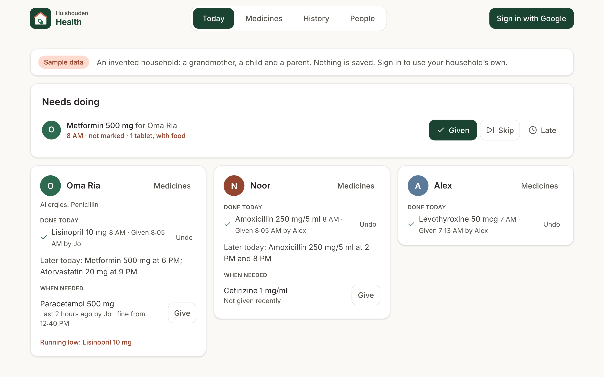
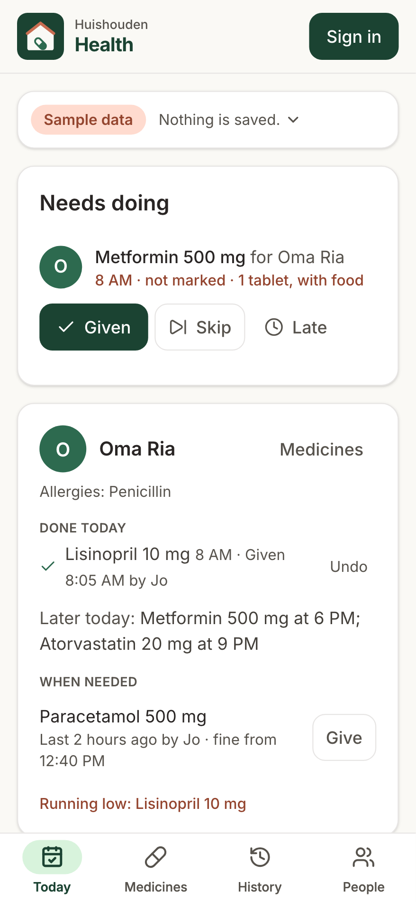
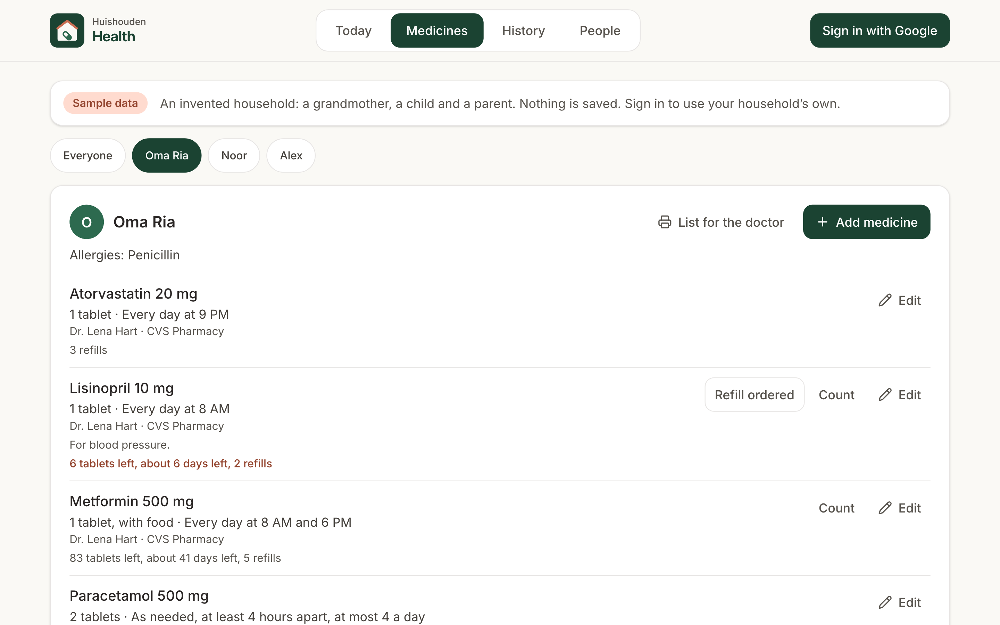
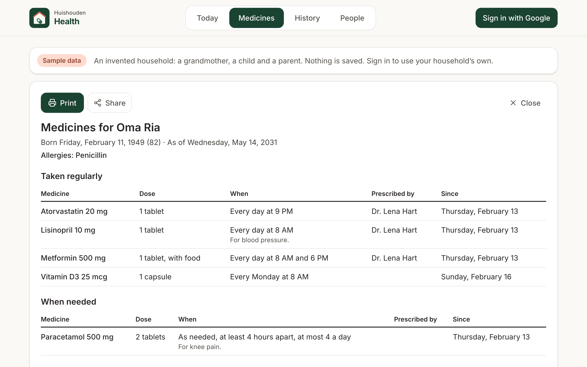
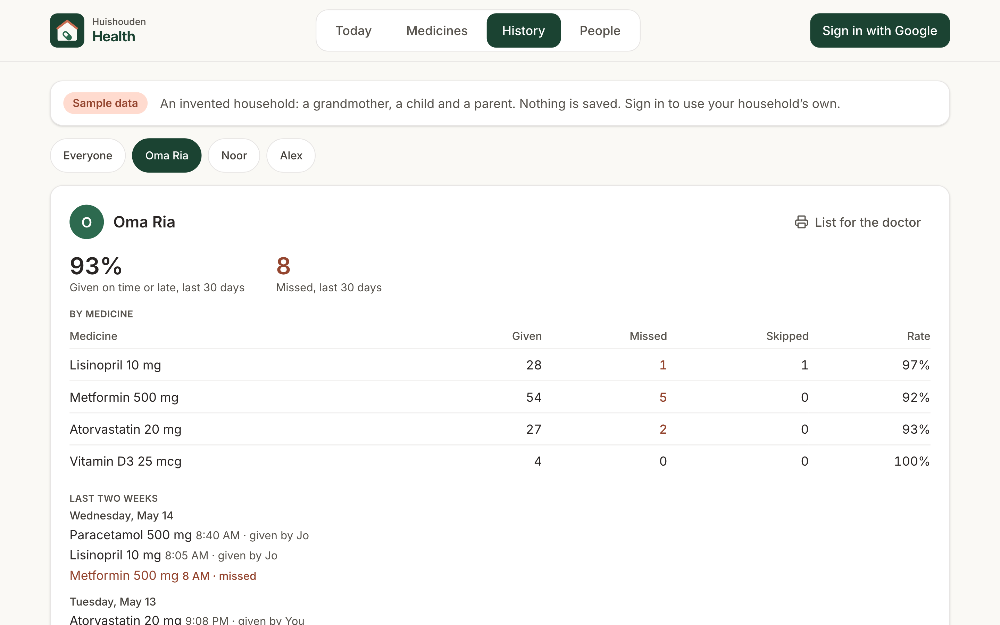
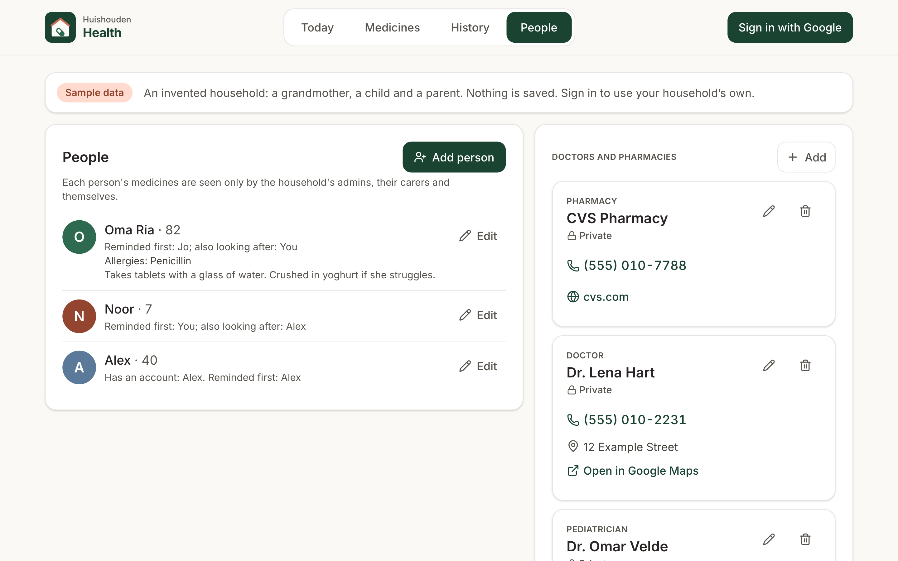
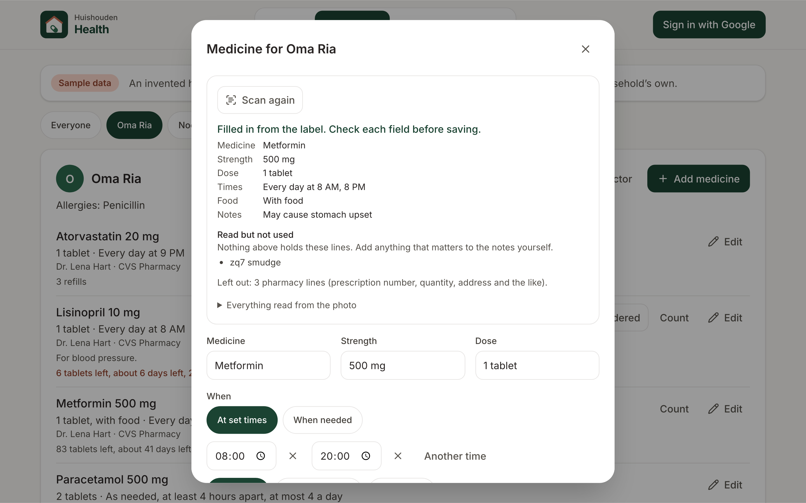
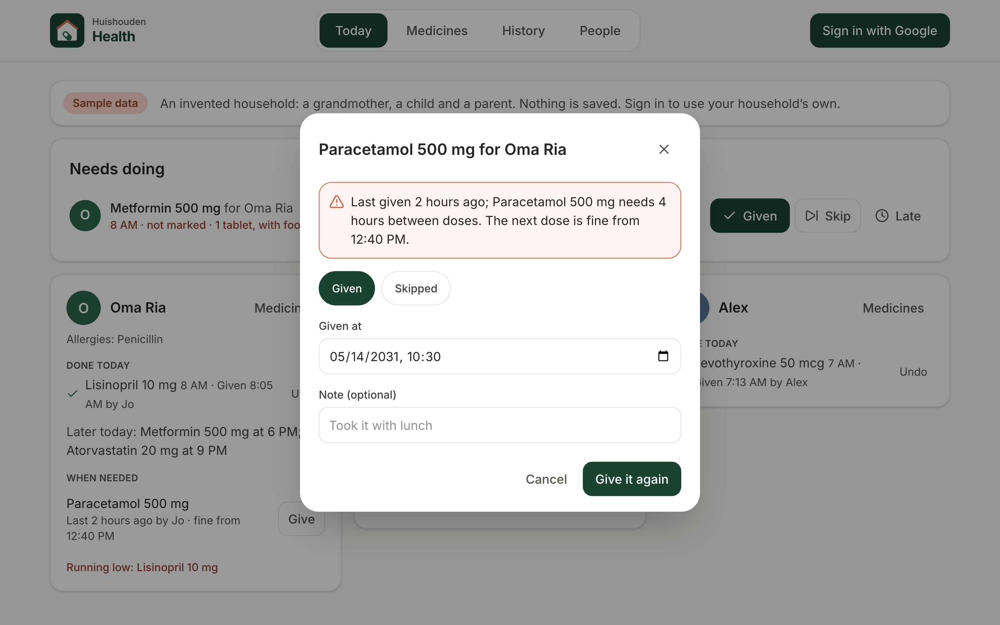

# Huishouden Health

Medicines and care for everyone at home.

Open it and the first thing you see answers "whose medicine is due now?": every dose due or not
marked yet, for everyone the household looks after, each with Given, Skip and Late (another time),
and Undo. Below that, each person's day: what was given, by whom and when, what is still to come,
the medicines taken when needed (with how long since the last dose), and anything running low.
Medicines holds each person's list (dose, when, with food or not, who prescribed it, which pharmacy,
supply and refills); a pharmacy label can be scanned to fill it in. History counts the doses given,
skipped and missed, and every list prints or shares as one page for a doctor's visit.

It is for anyone the household gives medicine to: a grandparent without an account, a child, or a
member who wants their own reminders. Each person's medicines are seen only by the household's
admins, the people chosen to look after them, and the person themself.

Live at https://huishouden-piekstra.web.app/health/, also linked from the [Huishouden portal](https://huishouden-piekstra.web.app). The old-style address huishouden-health.web.app redirects there.
Installable on the tablet, phones and laptops, and works offline (changes sync when the connection is back).

## Screenshots

| Today | Phone |
|---|---|
|  |  |

| Medicines | List for the doctor |
|---|---|
|  |  |

| History | People |
|---|---|
|  |  |

| Scan the label | A second dose too soon |
|---|---|
|  |  |

_Screenshots of the live site signed out, which shows an invented household dated in 2031. Refreshed by CI after each deploy._

## How it works

- **Doses**: a scheduled dose is due from 30 minutes before its time until two hours after, then
  missed. Marking one writes a dose under the person (`healthPeople/{person}/doses`, one document per
  scheduled dose, so two devices marking it at once write one). Given more than two hours late shows
  as "Given late".
- **Double doses**: before Given, a scheduled medicine already given within half the time between its
  doses (at least an hour), or an as-needed one given sooner than its hours between doses or more
  often than its most a day, asks first and says who gave the last one and when
  (`@huishouden/pwa-kit/dose` `recentlyGiven`, `asNeededCheck`).
- **Supply**: the count on hand when it was last counted, less the doses given since; at a week left
  the medicine shows as running low.
- **Scan the label** (`@huishouden/pwa-kit/react/dose` `LabelScan`): read on the device, never
  uploaded or kept. The form shows what was filled in, what to check, and the lines read but not used.

## Reminders, the portal and privacy

Health publishes for named people only (pwa-kit STANDARD.md "For named people only"): every item it
writes for the rest of the suite names its audience, the household's admins and the person's carers
(and the person, when they are a member), never kids, and only they can read it.

| Where | What | Says |
|---|---|---|
| Portal Today and Calendar (`personalAgenda`) | Each person's dose times today and tomorrow | "Medicine for Oma Ria", "2 medicines": never a medicine's name |
| Portal To-do (`personalTodos`) | A dose time not marked in the last 24 hours, with Given and Skipped; a medicine running low, with Ordered | "Not marked: 8 AM medicine for Oma Ria", "Refill a medicine for Oma Ria" |
| Notifications (`personalReminders`, sent by [huishouden/notify](https://github.com/huishouden/notify)) | At each dose time to the main carer; if still not marked after the medicine's window (30 minutes unless changed), to the other carers; a week before a medicine runs out | The medicine's name, on the recipients' own devices |

Every device that can see a person keeps these current on open and a few seconds after each change,
a week of reminders ahead. Marking a dose removes its "not marked" notification before it is sent.

## Data

Under `households/{householdId}`, everything about a person lives under their document, so the rules
let only admins and that person's readers (their carers and themself) read it; kids never. Admins and
member carers change people and medicines; helper carers mark doses (and change only their own) and
can say a refill is ordered.

| Collection | Fields |
|---|---|
| `healthPeople` | name, birthDate, email (their own account, if a member), carers (main carer first), readers (carers and email), allergies, notes, createdAt, updatedAt, by |
| `healthPeople/{id}/photo/avatar` | data (a WebP or JPEG data URL), updatedAt, by |
| `healthPeople/{id}/meds` | personId, name, strength, dose, doseAmount, doseUnit, asNeeded, times, everyDays or rule (`EventRule`), minHours, maxPerDay, withFood, startDate, endDate, prescriberId, pharmacyId (household contacts), refills, supply, supplyAt, refillOrderedAt, escalateMinutes, remind, notes, createdAt, updatedAt, by |
| `healthPeople/{id}/doses` | personId, medId, slot (`YYYY-MM-DDTHH:MM` for a scheduled dose), at, status (`given` or `skipped`), note, by, createdAt |

Rules and their emulator tests: [huishouden/rules](https://github.com/huishouden/rules).

## Privacy

What the suite sends to its error and usage reports is described on the portal's
[Privacy](https://huishouden-piekstra.web.app/privacy) page. Health also registers every medicine and
person name it holds with the kit's `setSensitiveWords`, so none of them can reach a report.

## Development

```sh
bun install
bun run env:pull   # the Firebase web config from the repo variables, into .env.local
bun run dev
bun run lint && bun test src
bun run build && bun run preview
BASE_URL=http://localhost:4173/health/ bun run e2e
```

Signed out, the app shows an invented household (`src/lib/demo.ts`); `?as=helper` shows it as Jo,
the home carer, and `?as=kid` as a kid. CI (`pwa-kit` `pwa.yml`) deploys pull requests to
`huishouden-staging-health.web.app/health/` and runs the signed-in tests there; `main` deploys the
suite's one site.
