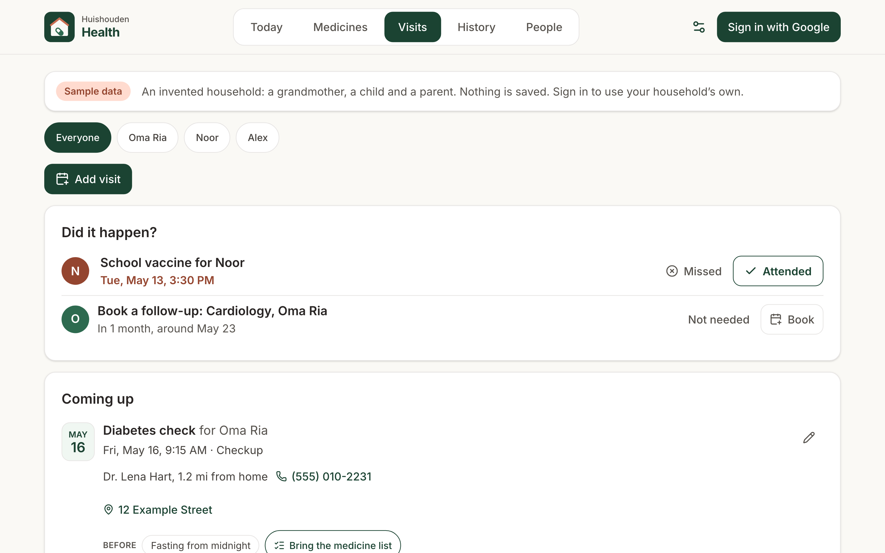
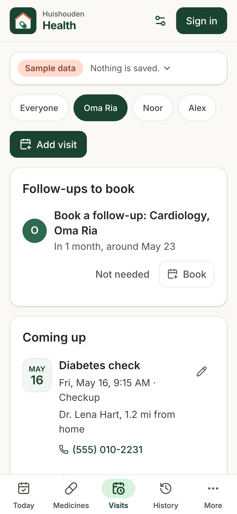

# Huishouden Health

Medicines and care for everyone at home.

Open it and the first thing you see answers "whose medicine is due now?": every dose due or not
marked yet, for everyone the household looks after, each with Given, Skip and Late (another time),
and Undo. Below that, each person's day: what was given, by whom and when, what is still to come,
the medicines taken when needed (with how long since the last dose), anything running low, and the next visit within a week, one tap to it.
Medicines holds each person's list (dose, when, with food or not, who prescribed it, which pharmacy
and how far it is from home, supply and refills); a pharmacy label can be scanned to fill it in. Visits holds
each person's appointments: a checkup, a specialist, the dentist, the eye doctor, a lab test, a vaccine or therapy,
with the doctor or clinic and how far it is from home, the place or the video link, what to do or bring
before ("Fasting from midnight", and the medicine list one tap away), reminders at the times chosen
(the day before and two hours before unless changed), notes, and a follow-up. Once a visit is over,
"Did it happen?" asks Attended or Missed, and a follow-up still to book stays until it is booked or not
needed. History counts the doses given, skipped and missed, and every list prints or shares as one page for a doctor's visit.

It is for anyone the household gives medicine to: a grandparent without an account, a child, or a
member who wants their own reminders. Each person's medicines and visits are seen only by the household's
admins, the people chosen to look after them, and the person themself. A visit's notes are for the admins
and the members who look after the person: a helper who takes someone along sees when, where and what
to bring, not what the doctor said.

Live at https://huishouden-piekstra.web.app/health/, also linked from the [Huishouden portal](https://huishouden-piekstra.web.app). The old-style address huishouden-health.web.app redirects there.
Installable on the tablet, phones and laptops, and works offline (changes sync when the connection is back).

## Screenshots

| Today | Phone |
|---|---|
|  |  |

| Medicines | List for the doctor |
|---|---|
|  |  |

| Visits | Visits on a phone |
|---|---|
|  |  |

| History | People |
|---|---|
|  |  |

| Scan the label | A second dose too soon |
|---|---|
|  |  |

_Screenshots of the live site signed out, which shows an invented household dated in 2031. Refreshed by CI after each deploy._

## How it works

- **Doses**: a scheduled dose is due from 30 minutes before its time until two hours after, then
  missed. Marking one writes a dose under the person (`healthPeople/{person}/doses`, one document per
  scheduled dose, so two devices marking it at once write one). Given more than two hours late shows
  as "Given late".
- **Double doses**: before Given, a scheduled medicine already given within half the time between its
  doses (at least an hour), or an as-needed one given sooner than its hours between doses or more
  often than its most a day, asks first and says who gave the last one and when
  (`@huishouden/pwa-kit/dose` `recentlyGiven`, `asNeededCheck`).
- **Supply**: the count on hand when it was last counted, less the doses given since; at a week left
  the medicine shows as running low.
- **How far**: once the household has set its home in the portal (`households/{id}.home`, kit
  `./home`), the pharmacy beside each medicine and each doctor's and pharmacy's card say how far
  they are from home ("2.3 mi from home"), measured on the device from the position the contact's
  map search found. The map search itself prefers places around home.
- **Visits** (`@huishouden/pwa-kit/visit`, shared with the assistant connector): coming up soonest
  first; once over, "Did it happen?" until someone marks it Attended or Missed (who and when, Undo for
  six hours); a visit with a follow-up ("in 3 months") then offers Book (the next visit filled in, that
  long after) and Not needed. Kinds: checkup, specialist, dentist, eye, lab or test, vaccine, therapy,
  other. Only the kind, the day and the time are needed; the rest is folded.
- **Calendar**: new events in the member's Google Calendar that name someone in Health ("Noor's flu
  shot") are suggested on Visits; Import from calendar lists every health appointment it finds and asks
  whose one is when its words name nobody, never assuming.
- **The assistant's appointments**: added before Health had visits, they were calendar items only; a
  keeper's device moves each into a visit (same id, the notes apart) the next time Health opens.
- **Scan the label** (`@huishouden/pwa-kit/react/dose` `LabelScan`): read on the device, never
  uploaded or kept. The form shows what was filled in, what to check, and the lines read but not used. A label photo can also be shared into Health from the phone's gallery (Share, then Health): it opens in a new medicine for the person on screen, or the first one you can edit; someone who can't add medicines is told so.

## Reminders, the portal and privacy

Health publishes for named people only (pwa-kit STANDARD.md "For named people only"): every item it
writes for the rest of the suite names its audience, the household's admins and the person's carers
(and the person, when they are a member), never kids, and only they can read it.

| Where | What | Says |
|---|---|---|
| Portal Today and Calendar (`personalAgenda`) | Each person's dose times today and tomorrow | "Medicine for Oma Ria", "2 medicines": never a medicine's name |
| Portal Today and Calendar, own calendars (`personalAgenda`) | Each visit, a month back to half a year ahead | "Appointment for Oma Ria"; the kind, doctor, place and what to bring only in a reader's own calendar with Health details on; never the notes |
| Portal To-do (`personalTodos`) | A visit over with a follow-up nobody booked, with Booked and Not needed | "Book a follow-up for Oma Ria", "Around Aug 15" |
| Notifications (`personalReminders`) | Before each visit, at its lead times, to the person's carers (else the person, else an admin) | "Appointment for Oma Ria": "Tomorrow at 9:15 AM: Checkup: Diabetes check with Dr. Example, 12 Example Street. Fasting from midnight and bring the medicine list." (a doctor marked private only when no helper carer is told) |
| Portal To-do (`personalTodos`) | A dose time not marked in the last 24 hours, with Given and Skipped; a medicine running low, with Ordered | "Not marked: 8 AM medicine for Oma Ria", "Refill a medicine for Oma Ria" |
| Notifications (`personalReminders`, sent by [huishouden/notify](https://github.com/huishouden/notify)) | At each dose time to the main carer; if still not marked after the medicine's window (30 minutes unless changed), to the other carers; a week before a medicine runs out | The medicine's name, on the recipients' own devices |

Every device that can see a person keeps these current on open and a few seconds after each change,
a week of reminders ahead. Marking a dose removes its "not marked" notification before it is sent,
also when it is marked on another phone or from the portal's To-do list (the sender checks the dose
records first), and ordering a refill drops its refill reminder.

## Data

Under `households/{householdId}`, everything about a person lives under their document, so the rules
let only admins and that person's readers (their carers and themself) read it; kids never. Admins and
member carers change people, medicines and visits; helper carers mark doses (and change only their own),
can say a refill is ordered, add visits (and change only their own) and mark any visit Attended or Missed.

| Collection | Fields |
|---|---|
| `healthPeople` | name, birthDate, email (their own account, if a member), carers (main carer first), readers (carers and email), allergies, notes, createdAt, updatedAt, by |
| `healthPeople/{id}/photo/avatar` | data (a WebP or JPEG data URL), updatedAt, by |
| `healthPeople/{id}/meds` | personId, name, strength, dose, doseAmount, doseUnit, asNeeded, times, everyDays or rule (`EventRule`), minHours, maxPerDay, withFood, startDate, endDate, prescriberId, pharmacyId (household contacts), refills, supply, supplyAt, refillOrderedAt, escalateMinutes, remind, notes, createdAt, updatedAt, by |
| `healthPeople/{id}/doses` | personId, medId, slot (`YYYY-MM-DDTHH:MM` for a scheduled dose), at, status (`given` or `skipped`), note, by, createdAt |
| `healthPeople/{id}/visits` | personId, kind, title, at, allDay, minutes, contactId (household contacts), location, link, prep, medList, remindBefore (minutes), followUp, followUpOf, followUpDoneAt, status (`attended` or `missed`), markedAt, markedBy, calendarEventId, calendarLink, createdAt, updatedAt, by, via |
| `healthPeople/{id}/visitNotes` | personId, text, updatedAt, by: admins and member carers only |

Rules and their emulator tests: [huishouden/rules](https://github.com/huishouden/rules).

## Privacy

What the suite sends to its error and usage reports is described on the portal's
[Privacy](https://huishouden-piekstra.web.app/privacy) page. Health also registers every medicine and
person name it holds, and each visit's title, place and what to bring, with the kit's `setSensitiveWords`, so none of them can reach a report.

## Development

```sh
bun install
bun run env:pull   # the Firebase web config from the repo variables, into .env.local
bun run dev
bun run lint && bun test src
bun run build && bun run preview
BASE_URL=http://localhost:4173/health/ bun run e2e
```

Signed out, the app shows an invented household (`src/lib/demo.ts`); `?as=helper` shows it as Jo,
the home carer, and `?as=kid` as a kid. CI (`pwa-kit` `pwa.yml`) deploys pull requests to
`huishouden-staging-health.web.app/health/` and runs the signed-in tests there; `main` deploys the
suite's one site.

## License

Source available under [PolyForm Shield 1.0.0](LICENSE): you may use, study and modify this code
for any purpose except providing a product that competes with Huishouden.

Huishouden and its logo are the project's brand; please don't use them for other products.
